.. Visualist documentation master file, created by
   sphinx-quickstart on Sun Feb 12 17:11:03 2012.
   You can adapt this file completely to your liking, but it should at least
   contain the root `toctree` directive.

Visualist: a spatial analysis plugin for crime analysts
=========================================================

.. toctree::
   :maxdepth: 2

This is a python plugin for Quantum GIS 3 (https://qgis.org/) [gis2019]_

.. index:: Aims

Aims
=====

The goal of Visualist is to provide a one-stop resource for many common Crime Analysts GIS tasks,
without the need for additional software, libraries, or complex workarounds.

If you use Visualist in a scientific publication, we recommand citations to the works cited in this webpage and we would appreciate the following reference:

Rossy, Q. (2019) Visualist: a spatial analysis plugin for crime analysts. *Ecole des sciences criminelles*, Lausanne. https://plugins.qgis.org/plugins/visualist/

.. index:: Plugin functionalities

Plugin functionalities
=======================

Visualist provides a growing suite of spatial data management and analysis functions that are
both quick and (I hope) functional.

.. rubric:: Cartography

- Proportional Symbols Map
- Grid Map
- Choropleth Map
- Edge Map
- Flow Map
- Graduated Lines Map
- Graduated Segmented Lines Map
- Nearest Neighbours Clusters Map
- Spatial Autocorrelation Map (LISA analysis)

.. rubric:: Spatial statistics

- K-Nearest neighbours analysis

Some functionalities from the qGis 2.0 version have been removed.
The following plugins are recommended:

**Spreadsheet Layer** (https://plugins.qgis.org/plugins/SpreadsheetLayers/)
Load layers from spreadsheet files (\*.ods, \*.xls, \*.xlsx)

**Load Them All** (https://plugins.qgis.org/plugins/loadthemall/)
Loads files stored in a directory structure recursively, based on several filters

or

**Layers menu from project** (https://plugins.qgis.org/plugins/menu_from_project/)
Allow easy opening of layers maintaining their styles

If you would like to report a bug, make suggestions for improving Visualist,
or have a question about the tools, please use: https://github.com/esc-unil/Visualist/issues

Installing and using the plugin
================================

Install the plugin via the Plugin Manager (Plugins -> Manage and Install Plugins). Search for Visualist and install the plugin. 
To use the plugin, open the Processing Toolbox (Processing -> Toolbox or from the toolbar).
Open the Visualist list and choose the tool to run.

Proportional Symbols Map
=========================

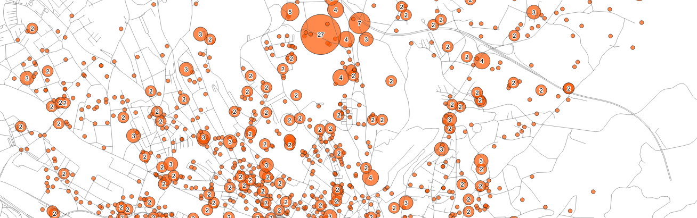

Proportional symbol maps groups all points with the same position together at a single point.
A circle whose size is proportional to the number of events is then created.

The points can also be grouped with a polygon layer to represent all cases
within each area as a single aggregate.

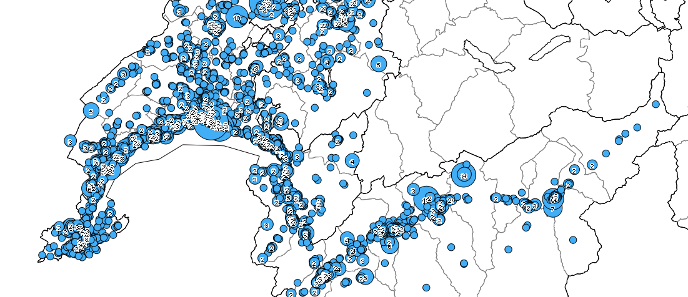
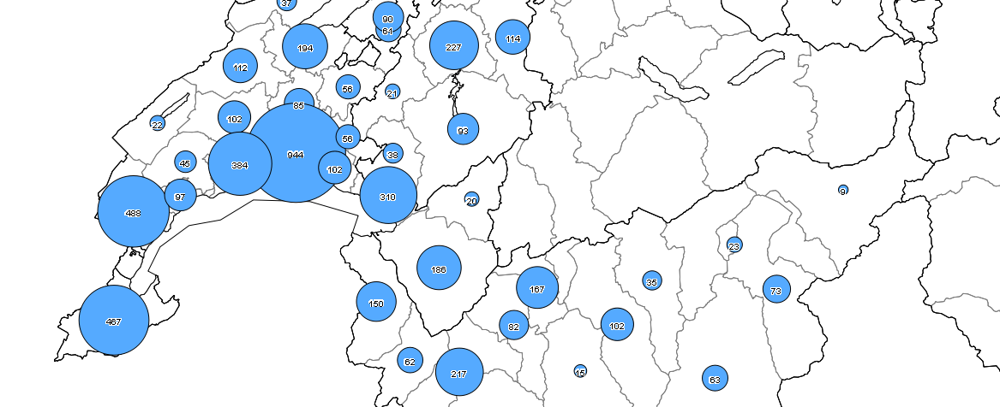

`Examples of maps with proportional symbols: on the right with a grouping of points with
the administrative layer of districts.`

Configuration
..............

**Points**

	The input points layer.

**Polygons [optional]**

	The optional polygon layer to aggregate points and use the centroid of areas.

**Count field name**

	Name of the field created in the output layer

**Output**

	A new point layer if a polygon layer is not defined, or a copy of the polygon layer with the a new count field.

Grid Map
=========

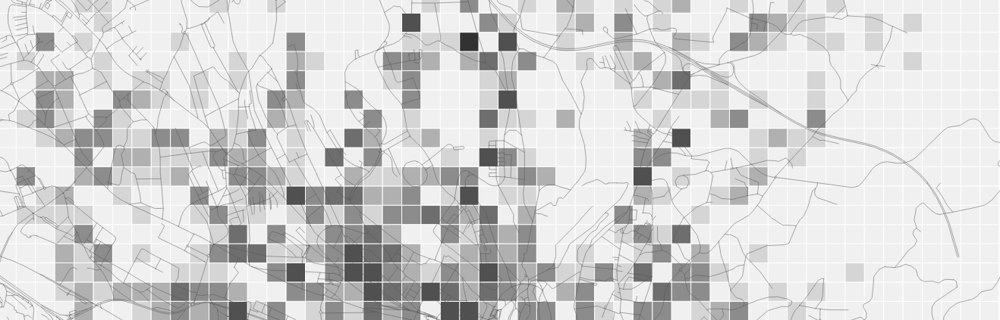

The grid map divides the area into squares and represents the number of events present in each cell.

The operation is quite simple.
The program creates a layer of polygons (squares) whose size can be configured.
Then the number of events present in each square is counted.

The choice of the grid size can be guided by the **average distance expected if the points were randomly distributed**:

`d = 0.5 * Square root of A/n where A = area and n = number of events`

Configuration
..............

**Points**

	The input points layer.

**Grid extent**

	Extent parameter to define the area of the grid (the extent of the canvas, the layer or a selection)

**Size of the grid**

	Distance parameter to define the size of each cell (in the units of the points layer).

**Count field name**

	Name of the field created in the output layer

**Output**

	A new polygon layer with a count field.

Choropleth Map
===============

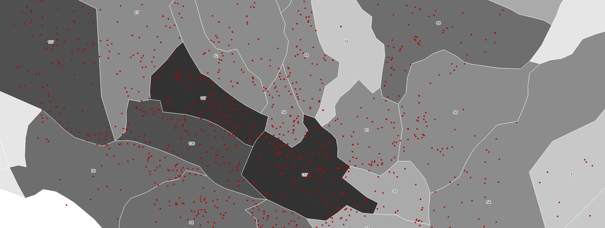

Choropleth maps represent a quantity (number of events, percentages, etc.) by color (or pattern) for administrative areas.
They allow values to be compared by region and demographic information to be used to weight measurements.

.. |guerry| image:: images/GuerryMaps.jpg
	:width: 99%

.. tabularcolumns:: |\Yc{0.2}|\Yl{0.4}|
.. list-table::
   :widths: 1 2
   :header-rows: 1

   * - History
     -
   * - |guerry|
     - **André-Michel Guerry**
	 Essai sur la statistique morale de la France.
	 Paris, Crochard,‎ 1833.

This type of map is relevant for a comparison by administrative region and
allows the number of events to be weighted against, for example,
the number of inhabitants, dwellings, businesses.

The operation is relatively simple. From a layer of polygons (administrative regions),
the number of events (from a layer of points) contained in each zone is calculated.
A new polygon layer containing a column storing the values is created.

Be careful, these maps generate the perception that the distribution of events is uniform in each area.

Configuration
..............

**Polygons**

	The polygon layer to aggregate points.

**Points**

	The input points layer.

**Weight field [optional]**

	A numeric field to weight the values (e.g. number of inhabitants or dwellings).

**Multiplier [optional]**

	A numeric value for weighting (default value si %)

**Count field name**

	Name of the field created in the output layer

**Output**

	A new polygon layer with a count field.

Edge Map
=========

.. image:: images/EdgeMap.png
	:width: 99%

The edge map reprents the edges between start and end points.

This script is based upon the work of:

 - **Anita Graser** : http://planet.qgis.org/planet/tag/flows/
 - **Alexander Bruy** : PointsToPaths.py script available in QGis

The operation is quite simple.
The program creates a layer of lines from points grouped by a shared value (i.e. an id of the link).
All edges sharing the same starting and ending points are grouped.
A point layer is also created to represent the number of events starting (orange) and ending (blue) at each node.

Configuration
..............

**Points**

	The input points layer.

**Group field**

	Parameter to identify the points belonging to the same edge.

**Order field**

	Number parameter to define the order of the sequence.

**Order date format [optional]**

	Optional parameter if a string datetime parameter is used as order field. Leave blank, if Order field is already a datetime field or a number.

**Fields to include [optional]**

	Multiple selection of fields to copy. *start_* and *end_* prefixes are used in the output for each field.

**Edges**

	Output: a new line layer with selected fields and a count field.

**End points**

  Output: a new point layer with selected fields and three count fields (total, in and out).

Flow Map
=========

.. image:: images/FlowMap.png
	:width: 99%

The flow map reprents the grouped flows of edges (e.g. created with the edge map algorithm, see above).
This script is based upon the work of **Anita Graser**:

http://planet.qgis.org/planet/tag/flows/

code avaible at https://github.com/dts-ait/qgis-edge-bundling

If you use this script in scientific publication, please cite [gra2017]_:

Graser, A., Schmidt, J., Roth, F., & Brändle, N. (2017 online) Untangling Origin-Destination Flows in Geographic Information Systems. Information Visualization - Special Issue on Visual Movement Analytics. doi:10.1177/1473871617738122.

URL: http://journals.sagepub.com/doi/full/10.1177/1473871617738122

Configuration
..............

**Edges**

	The input lines layer. If the input contains paths, the explode algorithm while split path in edges.

**Cluster field [optional]**

	Parameter to group lines. Use the K-mean clustering algorithm from QGis for instance. If no clusters are defined, the algorithm is slower.

**Initial step size**

	Depend upon the coordinate system. For instance, you may try 0.001 or 0.01 for GPS data, or 100 for projected data.

**Compatibility**

	From 0 to 1 : defines how many lines are grouped. A *low* value increases the grouping of paths.

**Cycles**

	Parameter that increases the number of line breaks.

**Iterations**

	Number of iterations of the force-directed layout.

**Maximum distance [optional]**

	Parameter used to merge overlapping segments. Depend upon the coordinate system.

**Weight field [optional]**

	If maxium distance is set, a weight can be used to sum overlapping weights. For instance, the field may contains the number of events for each lines.

**Flow Map**

  Output: a new line layer.

Graduated Lines Map
==============================

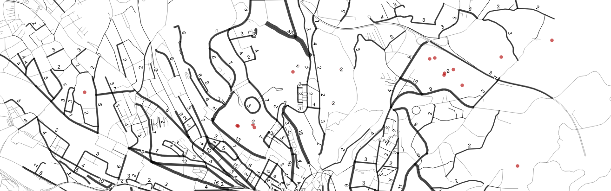

Graduated line maps represent the number of events along roads (polyline layer).
Events are projected onto the segments closest to their positions,
but only if the distance between them is less than a configurable threshold (e. g. 50 meters).

Configuration
..............

**Lines**

	The input lines layer to aggregate points.

**Points**

	The input points layer.

**Names of roads in lines / points layer [optional]**

	The string fields containing the names of roads to match (Levenshtein alg.)
	If they are not set, the closest line is used.

**Maximum distance to the line**

	A distance parameter (in units of the line layer) to avoid the projection of points too far from the lines.

**Count field name**

	Name of the field created in the output layer

**Outputs**

	A new line layer with a count field.

	A new proportional symbols layer with two classes of points:
	points linked to a line (in green) and points not linked to a line (in red).

Graduated Segmented Lines Map
==============================

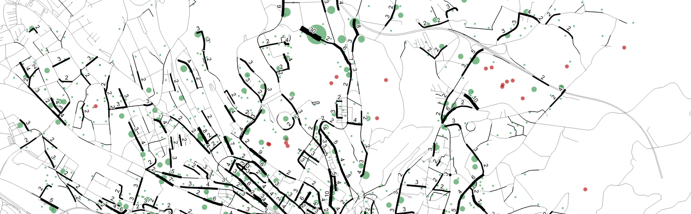

Graduated Segmented line maps represent the number of events along roads (polyline layer).
The algorithm starts by dividing the roads into segments whose length can be configured.
The segment closest to each point is then identified.
Events are projected onto the segments closest to their positions,
but only if the distance between them is less than a configurable threshold (e. g. 50 meters).

Configuration
..............

**Lines**

	The input lines layer to aggregate points.

**Size of the segments**

	A distance parameter (in units of the line layer) to split the lines in segments

**Points**

	The input points layer.

**Names of roads in lines / points layer [optional]**

	The string fields containing the names of roads to match (Levenshtein alg.)
	If they are not set, the closest line is used.

**Maximum distance to the line**

	A distance parameter (in units of the line layer) to avoid the projection of points too far from the lines.

**Count field name**

	Name of the field created in the output layer

**Outputs**

	A new line layer with a count field.

	A new proportional symbols layer with two classes of points:
	points linked to a line (in green) and points not linked to a line (in red).

Nearest Neighbours Clusters Map
================================

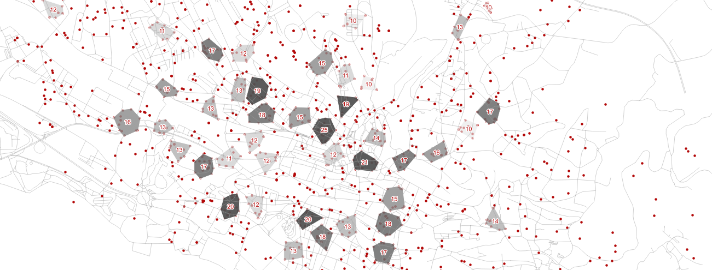

The map shows the hotspots identified by the analysis of the closest neighbours.
This algorithm is a simplified version of Ned Levine's algorithm [ned2015]_ in
CrimeStat: http://nij.gov/topics/technology/maps/pages/crimestat.aspx.

Explaination
.............

The algorithm works like this:

	1. For each event, a square centred on the position of the event and
	with a size of twice the search distance is used to
	select close neighbours. The distances with these neighbours are
	calculated and events are considered as close neighbours of the event
	if the distance is less than or equal to the search distance.

	2. The event with the most neighbours is selected. They form the first hot spot.
	They are removed from the distribution and the following event with the highest number
	of neighbours is selected. They form the second hot-spot, etc.
	The algorithm is recursive until there is no more events with a number of neighbours
	greater than or equal to the defined cluster size.

	3. For each cluster, the centre of gravity is calculated.
	The distances are recalculated with the gravity centres to ensure
	that the areas do not overlap. Indeed, some events may
	change groups if two hotspots are spatially close.

	4. The convex envelope of each cluster is used to
	represent the hot points by polygons.

Unlike Ned Levine's algorithm in CrimeStat (Nearest Neighbour Hierarchical Clustering) [ned2015]_,
the map represents only first-order clusters.

Examples
.........

The examples below show the advantages of using this
method rather than a density map or grid map

.. image:: images/NearNeighborsVSHeatmap.png
	:width: 99%

Nearest Neighbours Clusters always contain events, unlike the heatmap
(the worst method for crime analysis thus not include in the plugin).
In addition, the quantities directly represent the number of events that occurred in each area.

.. image:: images/NearNeighborsVSGrid.png
	:width: 99%

Areas are defined directly by the distribution of the events, while on a grid map
the aggregation is defined by the size of the grid and the position of the total area.
On a grid map, the origin of the grid changes the representation.

Configuration
..............

**Points**

	The input points layer.

**Maximum distance between points**

	A distance parameter (in units of the point layer) to define what is a close neighbour.

	The choice of the distance should be guided by the **average distance expected if the points were randomly distributed**:

	`d = 0.5 * Square root of A/n where A = area and n = number of events`

**Minimum size of the clusters**

	A numeric parameter to define the size of the clusters (i.e. the minimum number of events to consider an area as a hotspot).

**Count field name**

	Name of the field created in the output layer

**Output**

	A new polygon layer with a count field.

Spatial Autocorrelation Map
============================

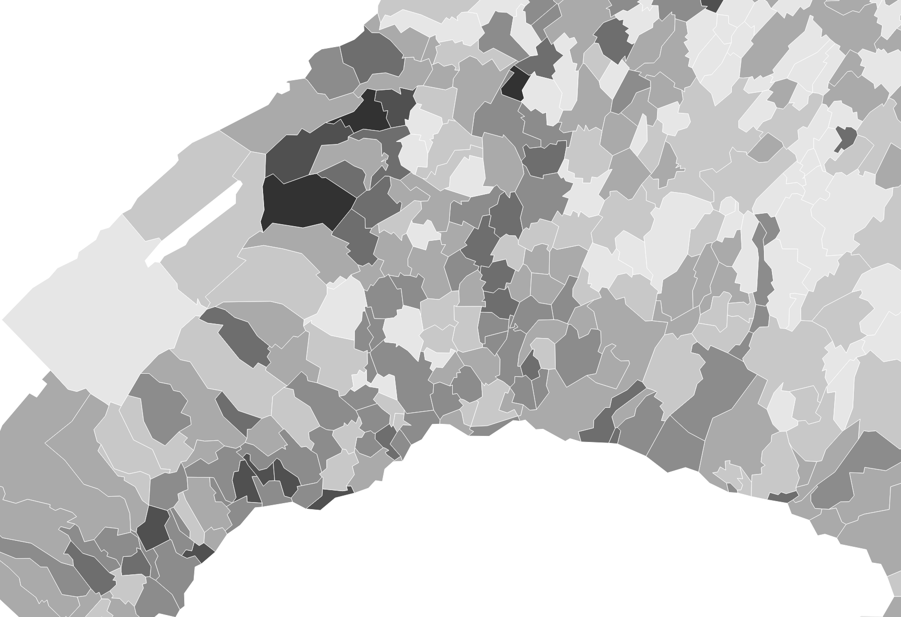
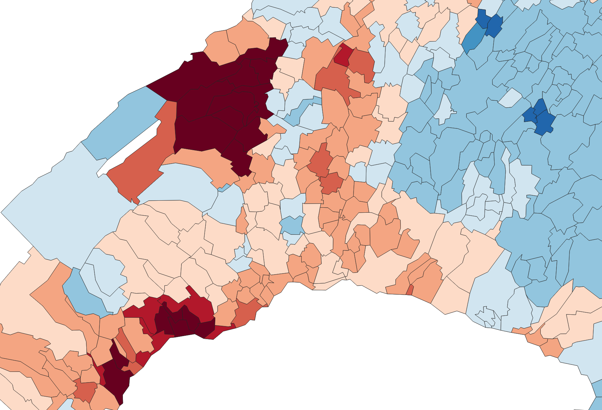
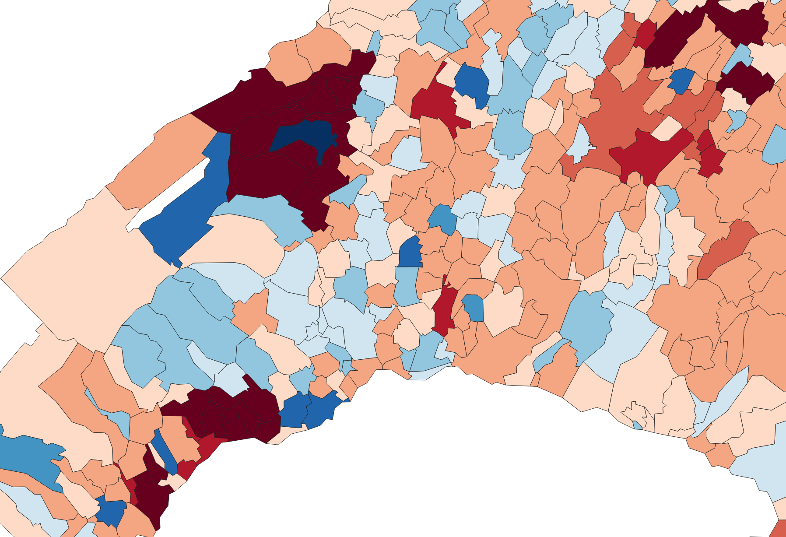
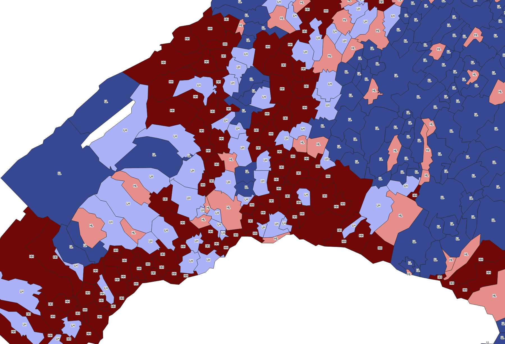

Analysis of local spatial autocorrelation statistics.
The plugin cover the Local Moran's I *(Clusters and Outliers Analysis)*, and Getis-Ord Gi* *(Hot-Spot Analysis)* statistics.

These maps are generated with PySAL: Python Spatial Analysis Library from Rey, S.J. and L. Anselin [ran2010]_

see: https://geodacenter.github.io/workbook/6a_local_auto/lab6a.html

Configuration
..............

**Polygons**

	The input polygons layer.

**Values**

	The numeric field used to perform the analysis

**LISA Indicator**

	*Local Moran's I* : Clusters and Outliers Analysis (HH, HL, LH, LL) based on covariance

	*Getis-Ord Gi\** : Hot-Spot Analysis based on the product of intensities

**Spatial weight matrix**

	The W matrix is called the connectivity, contiguity or spatial weight matrix
	whose values are a function of some measure of contiguity in the original data

	*Queen* : Common sides and common vertices of the polygons are considered

	*Rook* : Only common sides of the polygons are considered

	*Bishop* : Only common vertices of the polygons are considered

	*Distance* : Distance-based spatial weights

	*Near neighbours* : K-Nearest Neighbour weights

**Distance [optional]**

	*If distance-based spatial weights is used* : bandwidth, in units appropriate for the projection used

	*If K-Nearest Neighbour weights is used* : number of neighbours (k)

**Output**

	A new polygon layer with the results of the spatial analysis.

K-Nearest Neighbours analysis
=============================

.. image:: images/NearNeighborsAnalysis.png
	:width: 99%

A simple visualization with plotly of the K-Nearest Neighbours of a points layer.
A Nearest Neighbour Index (NNI) plot is also calculated.

To extract the data: open the output HTML file (in the results viewer) and click on *'Export to plot.ly'*
(not available within the dialog)

.. index:: Acknowledgements

Acknowledgements
=================

This 3.0 version was created with Plugin Builder (http://g-sherman.github.io/Qgis-Plugin-Builder/)

It integrates:

-  a light version of the pysal module for LISA analysis (https://pysal.readthedocs.io/en/latest/)

-  functionalities inspired from Victor Olaya's processing plugins (https://github.com/volaya?tab=repositories)

-  functionalities inspired from Anita Graser's scripts (http://planet.qgis.org/planet/tag/flows/)

-  functionalities inspired from Crimestat made under the direction of Ned Levine (https://nij.gov/topics/technology/maps/pages/crimestat.aspx)

Many many thanks to all the community of Quantum GIS !

References
===========

.. [gis2019]  Development Team (2019). Quantum GIS geographic information system. Open Source Geospatial Foundation Project

.. [gra2017]  GRASER, A., SCHMIDT, J., ROTH, F., & BRÄNDLE, N. (2017 online) Untangling Origin-Destination Flows in Geographic Information Systems. Information Visualization - Special Issue on Visual Movement Analytics. doi:10.1177/1473871617738122. URL: http://journals.sagepub.com/doi/full/10.1177/1473871617738122

.. [ned2015] LEVINE, Ned (2015). CrimeStat: A Spatial Statistics Program for the Analysis of Crime Incident Locations (v 4.02). Ned Levine & Associates, Houston, Texas, and the National Institute of Justice, Washington, D.C. August.

.. [ran2010] REY, Sergio J. & ANSELIN, Luc. (2010). PySAL: A Python library of spatial analytical methods. In : Handbook of applied spatial analysis. Springer, Berlin, Heidelberg, 2010. p. 175-193.

Indices and tables
===================

* :ref:`genindex`
* :ref:`modindex`
* :ref:`search`
